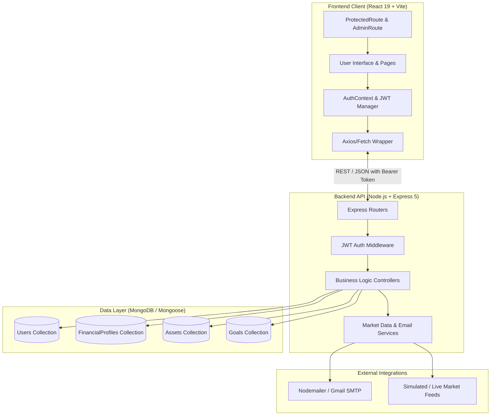
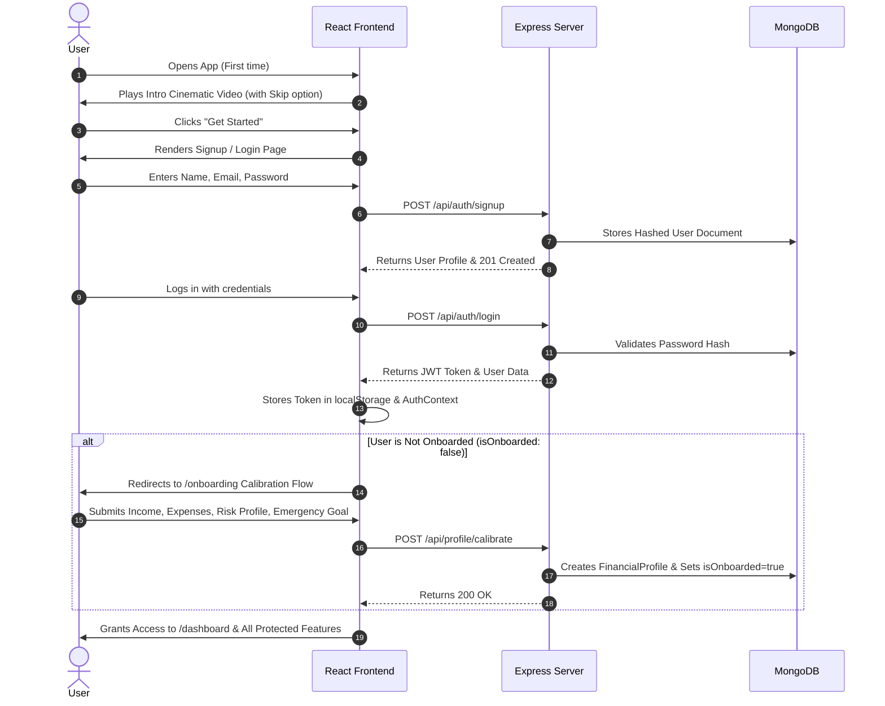
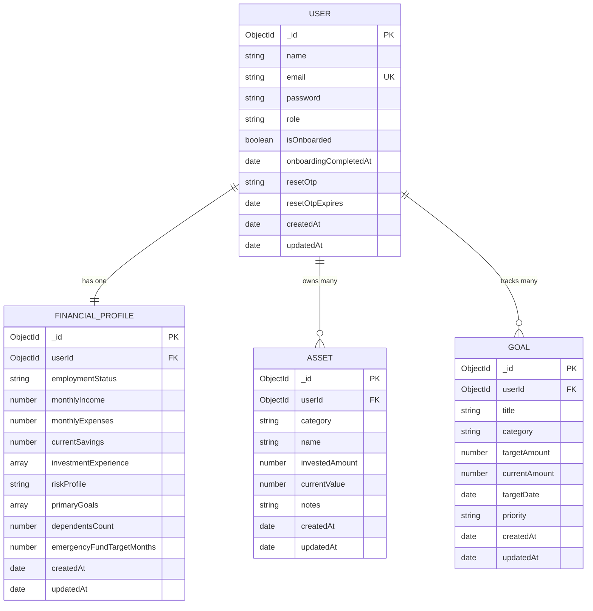

# 🚀 WealthX (teamVisionX) — Complete Project Workflow & Architecture

Welcome to the technical workflow documentation for **WealthX** (by **teamVisionX**). This document outlines the end-to-end architecture, data flows, core modules, API endpoints, business logic algorithms, and user lifecycle workflows across the application.

---

## 📑 Table of Contents
1. [Project Overview](#-project-overview)
2. [High-Level Architecture](#-high-level-architecture)
3. [Core Technology Stack](#-core-technology-stack)
4. [End-to-End User Journey & Workflow](#-end-to-end-user-journey--workflow)
   - [Phase 1: First Impression & Landing](#phase-1-first-impression--landing)
   - [Phase 2: Authentication & Password Recovery](#phase-2-authentication--password-recovery)
   - [Phase 3: Financial Profile Calibration (Onboarding)](#phase-3-financial-profile-calibration-onboarding)
   - [Phase 4: Central Command Dashboard](#phase-4-central-command-dashboard)
   - [Phase 5: Wealth Vault (Asset Management)](#phase-5-wealth-vault-asset-management)
   - [Phase 6: Financial Milestones & Goals](#phase-6-financial-milestones--goals)
   - [Phase 7: Financial X-Ray (Diagnostic Engine)](#phase-7-financial-x-ray-diagnostic-engine)
   - [Phase 8: Intelligent Action Plan](#phase-8-intelligent-action-plan)
   - [Phase 9: Investment Hub & Educational Modules](#phase-9-investment-hub--educational-modules)
5. [Database Models & Relationships](#-database-models--relationships)
6. [API Route Directory](#-api-route-directory)
7. [Business Logic & Diagnostic Algorithms](#-business-logic--diagnostic-algorithms)
8. [Security & State Management Workflow](#-security--state-management-workflow)
9. [Running the Project Locally](#-running-the-project-locally)

---

## 🌟 Project Overview

**WealthX** is a comprehensive personal finance and wealth management platform designed to help users:
- Consolidate and track all investment assets (Equities, Mutual Funds, Fixed Deposits, Gold, Bonds, ETFs, and Savings).
- Calibrate their financial health with diagnostic metrics (Emergency Runway, Cash Flow, Savings Rate, Asset Concentration).
- Set and monitor timeline-driven financial goals with required monthly contributions.
- Receive dynamic, rule-based **Action Plans** prioritized to fix financial vulnerabilities.
- Explore stock market data and access interactive financial educational guides.

---

## 🏗️ High-Level Architecture



---

## 💻 Core Technology Stack

| Layer | Technologies Used | Description |
| :--- | :--- | :--- |
| **Frontend** | React 19, Vite, React Router DOM v7 | Single-Page Application (SPA) with responsive styling and state management |
| **Backend** | Node.js, Express.js 5 | Modular REST API server with routing and controllers |
| **Database** | MongoDB, Mongoose ORM | Document database with schema validation and indexing |
| **Security** | JWT (JSON Web Tokens), `bcrypt` | Token-based stateless authentication and salt-hashed password encryption |
| **Email/Alerts**| Nodemailer, SMTP (Gmail) | Automated delivery of 6-digit OTP codes for password recovery |
| **Market Data** | Custom Market Data Service | Real-time and simulated quotes for Indian market equities |

---

## 🔄 End-to-End User Journey & Workflow



---

### Phase 1: First Impression & Landing
1. **Intro Video Sequence (`/`)**:
   - When a user visits the app for the first time, a smooth cinematic drone video is presented (`IntroVideo.jsx`).
   - The user can watch or click **"Skip »"**.
   - A `localStorage` flag (`introVideoSeen = true`) remembers this preference so subsequent visits immediately load the landing page.
2. **Landing Page (`Home.jsx`)**:
   - Highlights WealthX core value propositions, feature overviews, and direct Call-To-Action (CTA) buttons to Login or Signup.

---

### Phase 2: Authentication & Password Recovery
1. **User Signup (`/signup`)**:
   - Validates input fields (`name`, `email`, `password`).
   - Checks if email is already registered in MongoDB.
   - Encrypts password using `bcrypt` (10 salt rounds) and creates the User record.
2. **User Login (`/login`)**:
   - Compares credentials using `bcrypt.compare()`.
   - Generates a signed JWT with a 1-day expiry.
   - Returns token and profile details.
3. **Forgot Password & OTP Flow**:
   - **Step 1 (`POST /api/auth/forgot-password`)**: User inputs email. Server verifies account, generates a secure 6-digit numeric OTP with a 5-minute expiry (`resetOtpExpires = Date.now() + 5*60*1000`), and sends it via Nodemailer SMTP.
   - **Step 2 (`POST /api/auth/verify-otp`)**: Client submits OTP. Server checks validity and timestamp.
   - **Step 3 (`POST /api/auth/reset-password`)**: User provides new password, which is hashed and updated in MongoDB while clearing the OTP fields.

---

### Phase 3: Financial Profile Calibration (Onboarding)
- Route: `/onboarding` (Protected, accessible right after signup).
- Steps:
  1. **Employment & Income**: Monthly earnings, employment status (`salaried`, `self_employed`, `business`, `student`, `retired`).
  2. **Monthly Outflows**: Recurring expenses, rent, bills, living costs.
  3. **Current Liquid Savings**: Cash, bank balances, liquid emergency reserves.
  4. **Risk Appetite & Horizon**: Risk tolerance (`conservative`, `moderate`, `aggressive`), investment experience, and dependents count.
  5. **Emergency Target**: Configurable target months (default: 6 months).
- On submission, `FinancialProfile` is saved and `User.isOnboarded` is flipped to `true`.

---

### Phase 4: Central Command Dashboard
- Route: `/dashboard`
- Aggregates real-time financial health snapshot:
  - **Net Worth**: Total recorded assets minus obligations.
  - **Monthly Cash Flow**: `Monthly Income - Monthly Expenses`.
  - **Asset Allocation**: Interactive percentage distribution across Mutual Funds, Stocks, Gold, FDs, Bonds, etc.
  - **Financial Health Summary**: Emergency runway status, savings rate, and goal progress bars.
  - **Quick Links**: Jump directly to Wealth Vault, Goals, Financial X-Ray, Action Plan, and Investment Hub.

---

### Phase 5: Wealth Vault (Asset Management)
- Route: `/wealth-vault`
- Endpoints: `GET /api/assets`, `POST /api/assets`, `PUT /api/assets/:id`, `DELETE /api/assets/:id`
- Features:
  - Add, edit, and delete holdings across asset classes (`stock`, `mutual_fund`, `sip`, `gold`, `fd`, `bond`, `etf`, `savings`, `other`).
  - Tracks **Invested Amount** vs **Current Valuation**.
  - Computes real-time **Unrealized Gain / Loss** (₹ and %).
  - Visual breakdown of overall asset distribution.

---

### Phase 6: Financial Milestones & Goals
- Route: `/goals`
- Endpoints: `GET /api/goals`, `POST /api/goals`, `PUT /api/goals/:id`, `DELETE /api/goals/:id`
- Features:
  - Users create targeted financial milestones (e.g., Emergency Fund, House Down Payment, Retirement, Vehicle, Child Education, Travel, Wealth Creation).
  - Target amount, current saved amount, and target completion date.
  - **Auto Pacing Calculations**: Calculates months remaining, percentage progress, and exact **Required Monthly Contribution** to achieve the milestone on time.

---

### Phase 7: Financial X-Ray (Diagnostic Engine)
- Route: `/financial-xray`
- Endpoint: `GET /api/financial-xray`
- Comprehensive analytical diagnostic report combining Profile, Assets, and Goals:
  - **Expense Ratio & Savings Rate**: Identifies whether monthly outflow exceeds healthy thresholds (> 70%).
  - **Emergency Fund Health**: Analyzes liquid months of survival (`Liquid Savings / Monthly Expenses`). Evaluated as *Strong* (>=6 mos), *Developing* (3-5.9 mos), or *Needs Attention* (<3 mos).
  - **Asset Concentration Diagnostics**: Detects if more than 65% of the portfolio is concentrated in a single asset category.
  - **Goal Velocity**: Flags milestones that are pacing behind schedule.
  - **Objective Insights**: Formulates clear diagnostic statements.

---

### Phase 8: Intelligent Action Plan
- Route: `/action-plan`
- Endpoint: `GET /api/action-plan`
- Translates diagnostics into an automated, prioritized to-do list:

| Priority | Trigger Condition | Recommended Action |
| :--- | :--- | :--- |
| 🔴 **HIGH** | Incomplete Onboarding Profile | Prompts user to calibrate profile. |
| 🔴 **HIGH** | Emergency Fund < 3 months | Prompts user to fortify emergency reserves first. |
| 🔴 **HIGH** | Expense Ratio > 70% of Income | Advises cash flow and burn rate optimization. |
| 🟡 **MEDIUM**| Goals pacing behind schedule | Provides required monthly SIP recalibration advice. |
| 🟡 **MEDIUM**| No financial goals created | Prompts creation of target milestones. |
| 🟡 **MEDIUM**| Empty Wealth Vault (0 assets) | Prompts user to consolidate investment assets. |
| 🟢 **LOW** | Asset category concentration > 65% | Advises broader diversification across classes. |
| 🟢 **LOW** | Positive cash flow + active assets | Recommends systematic compounding & index SIPs. |

---

### Phase 9: Investment Hub & Educational Modules
- Routes:
  - `/investments` (Hub Overview)
  - `/investments/stocks` (Interactive Stocks Explorer)
  - `/investments/sip` (Mutual Funds & SIP Guide)
  - `/investments/gold` (Digital Gold & SGB Guide)
  - `/investments/fd` (Fixed Deposit Ladders)
  - `/investments/bonds` (Government Securities & G-Secs)
  - `/investments/etfs` (Index Funds & ETFs)
- Features:
  - **Dynamic Valid Stock Search**: Users can search for any authentic Indian stock (e.g. Zomato, Tata Motors, Swiggy, HAL, Wipro, HDFC Bank, Reliance) by ticker, company name, or industry sector.
  - **Strict Validation Engine**: Only certified valid equities on Indian exchanges (NSE/BSE) are returned; invalid search queries gracefully display a "No Valid Stock Found" empty state with suggestions.
  - **Valuation Metrics & 30-Day Trendlines**: Displays P/E ratios, market capitalization, 52-week High/Low, daily volume, dividend yield, and business descriptions.
  - **Direct Wealth Vault Tracking**: One-click action to track the searched equity in the user's Wealth Vault.
  - **Educational Deep-Dives**: Comprehensive guides for SIPs, Gold, Fixed Deposits, Government Bonds, and Index ETFs covering advantages, risks, ideal time horizons, and tax considerations.

---

## 🗄️ Database Models & Relationships



---

## 📡 API Route Directory

### 1. Authentication Routes (`/api/auth`)
- `POST /api/auth/signup` — Create a new user account.
- `POST /api/auth/login` — Authenticate user and return JWT.
- `GET  /api/auth/me` — Get current logged-in user profile (`Bearer Token`).
- `POST /api/auth/forgot-password` — Request a 6-digit OTP via email.
- `POST /api/auth/verify-otp` — Validate the OTP.
- `POST /api/auth/reset-password` — Set new password using verified OTP.

### 2. Profile Routes (`/api/profile`)
- `GET  /api/profile` — Fetch user's financial profile.
- `POST /api/profile/calibrate` — Create / calibrate onboarding profile.
- `PUT  /api/profile` — Update financial profile parameters.

### 3. Assets & Wealth Vault (`/api/assets`)
- `GET    /api/assets` — Retrieve all user assets with summary metrics.
- `POST   /api/assets` — Add a new asset to Wealth Vault.
- `PUT    /api/assets/:id` — Update existing asset value or name.
- `DELETE /api/assets/:id` — Remove an asset from portfolio.

### 4. Goals & Milestones (`/api/goals`)
- `GET    /api/goals` — Retrieve all goals with auto-calculated pacing.
- `POST   /api/goals` — Create a new financial goal.
- `PUT    /api/goals/:id` — Update target amount, date, or saved funds.
- `DELETE /api/goals/:id` — Delete a goal.

### 5. Diagnostics & Recommendations
- `GET /api/dashboard` — Consolidated dashboard KPIs and metrics.
- `GET /api/financial-xray` — In-depth financial diagnostics and health score.
- `GET /api/action-plan` — Rule-based prioritized financial recommendations.

### 6. Investment Hub & Education (`/api/investments`)
- `GET /api/investments/modules` — List all educational modules.
- `GET /api/investments/modules/:category` — Detailed module content.
- `GET /api/investments/stocks` — Search & list stock quotes.
- `GET /api/investments/stocks/:symbol` — Detailed stock quote and metrics.

---

## 🧮 Business Logic & Diagnostic Algorithms

### 1. Goal Pacing & Required Monthly SIP
For any goal with target amount $T$, current saved $C$, and target date $D$:
$$\text{Remaining Amount} = \max(0, T - C)$$
$$\text{Months Remaining} = \max\left(1, \left\lceil \frac{D - \text{Current Date}}{30.44 \text{ days}} \right\rceil\right)$$
$$\text{Required Monthly Contribution} = \left\lceil \frac{\text{Remaining Amount}}{\text{Months Remaining}} \right\rceil$$

### 2. Emergency Runway Health
$$\text{Emergency Months} = \frac{\text{Liquid Savings}}{\text{Monthly Expenses}}$$
- **Strong (🟢)**: $\ge 6\text{ months}$
- **Developing (🟡)**: $3 \le \text{Months} < 6$
- **Needs Attention (🔴)**: $< 3\text{ months}$

### 3. Portfolio Concentration Index
$$\text{Category Allocation \%} = \frac{\sum \text{Current Value of Category}}{\text{Total Portfolio Current Value}} \times 100$$
- If any single category represents $\ge 65\%$ of the total investment portfolio, a **Concentration Risk Flag** is raised.

---

## 🔒 Security & State Management Workflow

1. **Token Flow**:
   - Upon successful login, the server issues a signed JWT containing `{ id: user._id, role: user.role }`.
   - The React client stores this token in `localStorage` and includes it in the `Authorization: Bearer <token>` header via `apiClient.js`.
2. **Route Guards**:
   - `ProtectedRoute.jsx`: Redirects unauthenticated users to `/login`.
   - `requireOnboarded`: Prevents access to `/dashboard`, `/wealth-vault`, etc., until the user completes the `/onboarding` calibration.
   - `PublicOnlyRoute`: Prevents logged-in users from revisiting `/login` or `/signup` unnecessarily.
3. **Graceful Database Fallback**:
   - Backend connects to `process.env.MONGO_URI` by default.
   - In local development, if MongoDB is not locally running, it automatically switches to an in-memory database (`mongodb-memory-server`) so testing and development run without interruption.

---

## ⚡ Running the Project Locally

### 1. Start the Backend API
```bash
cd server
npm install
npm start
```
*Backend runs on `http://127.0.0.1:5000`*

### 2. Start the Frontend Application
```bash
cd client/vite-project
npm install
npm run dev
```
*Frontend runs on `http://127.0.0.1:5173`*

---

*Authored for teamVisionX | WealthX Platform*
